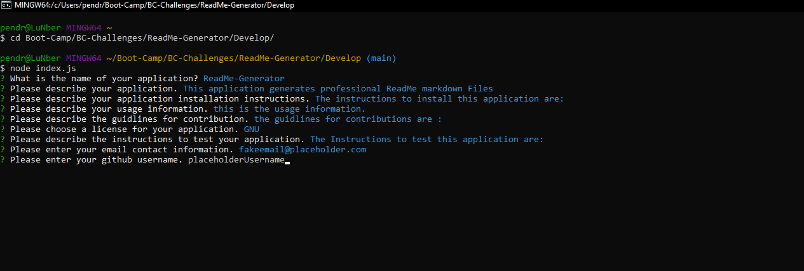
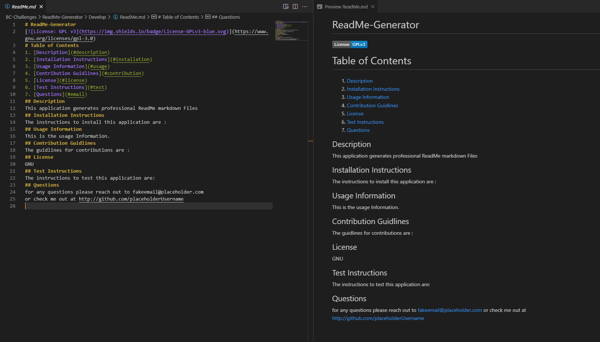

# ReadMe-Generator

## Description
    This application prompts and generates professional README markdown files. 
    I built this project to test my knowledge of Node.js as well as my ability to incorporate inquirer.js.
    
    The problem this application helps alleviate is the difficult task of creating a professional readme
    as a new up and coming developer attempting to submit their  portfolios for job applications. 
    I learned a lot more about utilizing inquirer in this project. 
  
## Installation Instructions
    The only thing that needs to be installed for this application is going to be NodeJS. Included 
    here will be a link toinstructions on how to properly install Node.
    https://coding-boot-camp.github.io/full-stack/nodejs/how-to-install-nodejs
    
## Usage
    Below is a link to a video demo of the ReadMe Generator application running.  

## <https://youtu.be/sDBHy55hxtI>

    
## Contribution Guidlines
    Seeing that this assignment was given with starter code, the only contributors to the project would 
    of course be the UCI coding bootcamp team that provided said starter code. 
   
